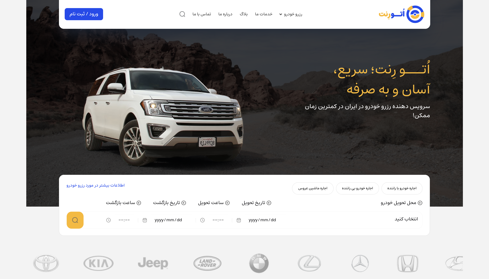

# 🚗 Car Rental Website

A modern car rental website built using HTML, Tailwind CSS, DaisyUI, and Swiper.js.

This project focuses on translating a complete desktop Figma design into a clean, modern, and user-friendly car rental website.

## 🔗 Live Demo

[Autorent Website](https://rosaraad.github.io/Autorent/)

## 📸 Preview

## 🎥 Demo

## ✨ Features

- Modern UI based on Figma design
- Multiple website pages
- Date and time selection
- Pickup location selection
- Interactive hover effects and smooth interactions
- Styled components using Tailwind CSS and DaisyUI

## 🛠️ Built With

- HTML
- Tailwind CSS
- DaisyUI
- Swiper.js

## 👩‍💻 Author

**Rosa Raad**

[GitHub](https://github.com/rosaraad)
